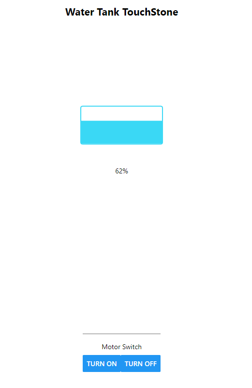
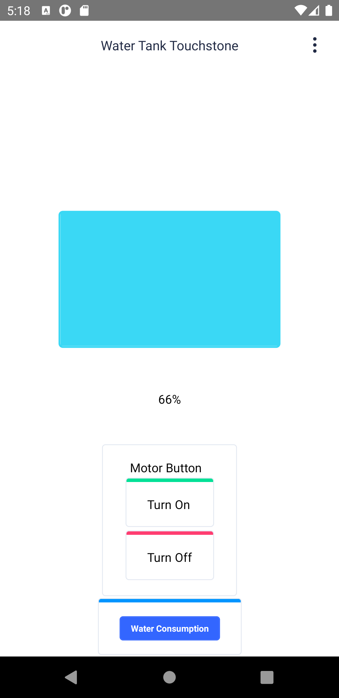
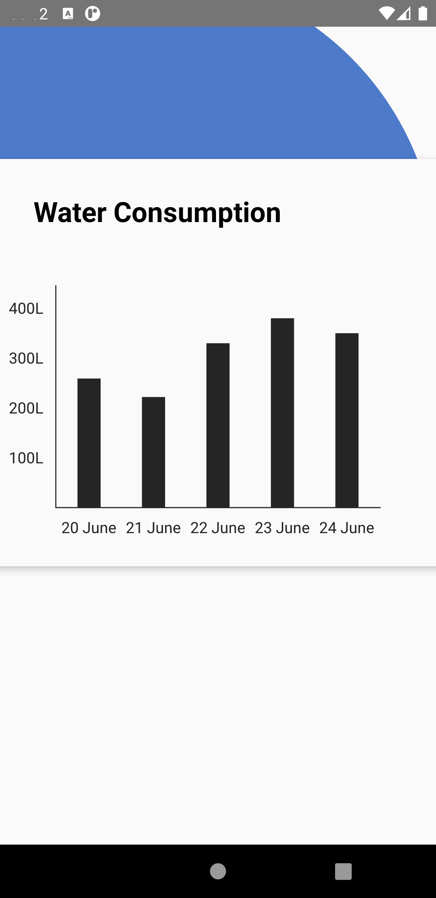
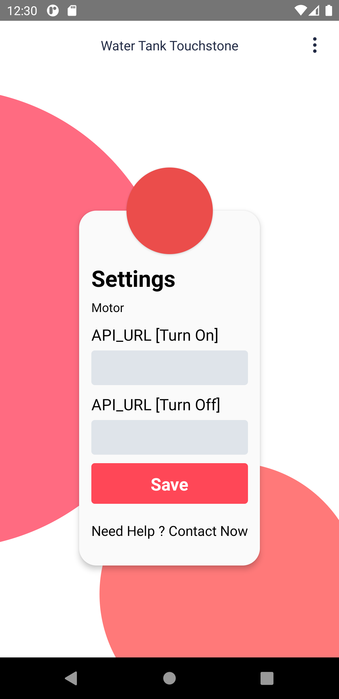

# Water tank Touch Stone

This Application helps you to get to know about your water tank level in Mobile Application through Ultrasonic Sensor.

*Stack used*
1. React Native (Mobile Application Development)
2. Arduino IDE 

*Harware Requirement*

1 Node MCU( Built in WIFI)
2. Jumper Wire
3. Router
4. Ultrasonic sensor
5. Power Source

